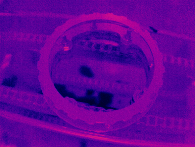
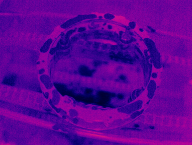
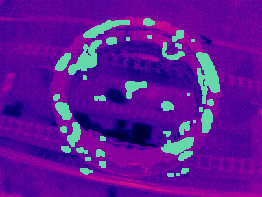

# Wetness Mapper

A Python-based tool designed to calculate and visualize surface wetness indices from geospatial datasets.  
Utilizing satellite imagery and geospatial data, this tool aids in environmental monitoring, hydrological studies, and land management by providing insights into surface moisture distribution.

---

## Features

- **Wetness Index Calculation**: Processes data geospatial data to compute, surface moisture levels.
- **Visualization**: Generates visual representations of wetness indices to facilitate analysis and interpretation.

---

## Example Visualizations

### Example 1 – Wetness Detection Process

**Dry component**  

<!--   -->

**Wet component**  

<!--  -->

**Detected Wet Areas**  

<!--  -->

---

## Installation

1. **Clone the Repository**

   ```bash
   git clone https://github.com/Apfelirne5/wetness-mapper.git
   cd wetness-mapper

├── requirements.txt        # Python dependencies
└── README.md               # Project documentation

Contributions are welcome! Please fork the repository and submit a pull request. For major changes, open an issue first to discuss your proposed modifications.
